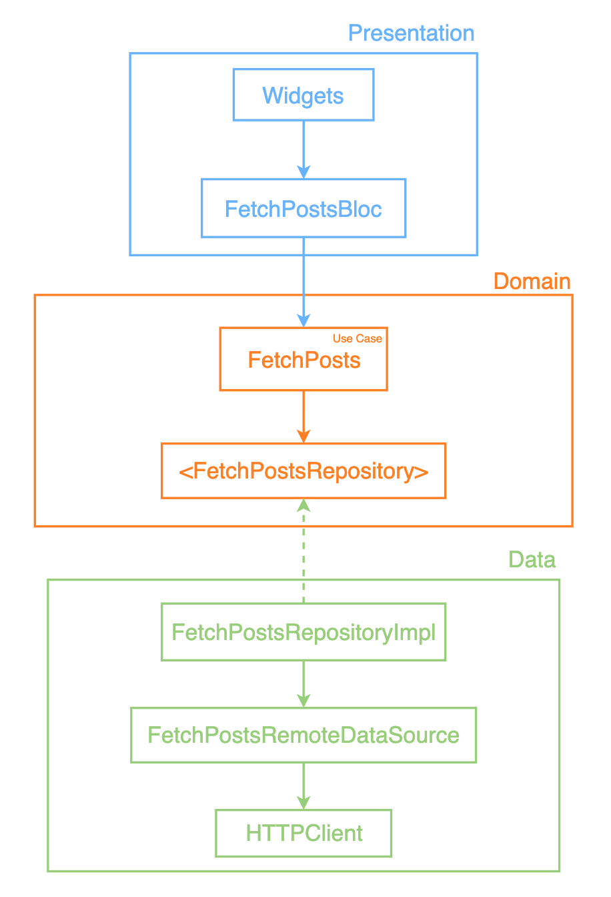
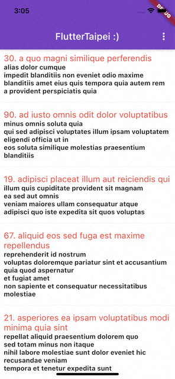

# 📢📢📢 Flutter Best Architecture Challenge 📢📢📢
此為參加 Flutter Best Architecture Challenge 活動的專案 

---
## Architecture

- Clean architecture with Bloc, reference: [TDD Clean Architecture](https://resocoder.com/2019/08/27/flutter-tdd-clean-architecture-course-1-explanation-project-structure/)
  
- Separate into 3 layers:
  1. Presentation Layer
  2. Doamin Layer
  3. Data Layer

- Graph:


---
## 3rd Party Libraries

- [get_it](https://pub.dev/packages/get_it) - Setting up a service locator, for injecting dependencies
- [flutter_bloc](https://pub.dev/packages/flutter_bloc) - For BLoC design pattern
- [equatable](https://pub.dev/packages/equatable) - For value based equality
- [dartz](https://pub.dev/packages/dartz) - For some functional programming tools
- [bloc_test](https://pub.dev/packages/bloc_test) - Easy to test blocs
- [mockito](https://pub.dev/packages/mockito) - APIs for Fakes, Mocks..etc
- [build_runner](https://pub.dev/packages/build_runner) - For for Dart code generation
- [http](https://pub.dev/packages/http) - Future-based API for HTTP requests
___
## Preview


---
## Environment

```
Flutter 2.2.1 • channel stable • https://github.com/flutter/flutter.git
Framework • revision 02c026b03c (5 weeks ago) • 2021-05-27 12:24:44 -0700
Engine • revision 0fdb562ac8
Tools • Dart 2.13.1
```


